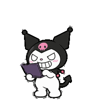

# Kuromi, villana programadora

Laptop morada, sonrisa de «fufufu» y actitud de villana mientras trabaja.

## Archivos

- `spritesheet.png`: hoja transparente v2 de 1536 × 2288 píxeles; 8 columnas y 11 filas, con celdas de 192 × 208 píxeles.
- `pet.json`: distribución de las 73 poses, dimensiones y SHA-256 de la hoja.
- `previews/`: nueve animaciones principales, recorrido de miradas, transición de reposo a salto y vista completa en GIF y MP4.
- `qa/`: resultados de validación de calidad y revisión independiente de las miradas.

| Fila | Estado | Fotogramas |
| --- | --- | ---: |
| 0 | Reposo | 6 |
| 1 | Correr hacia la derecha | 8 |
| 2 | Correr hacia la izquierda | 8 |
| 3 | Saludar | 4 |
| 4 | Saltar | 5 |
| 5 | Reaccionar a un fallo | 8 |
| 6 | Esperar una respuesta | 6 |
| 7 | Trabajar / programar | 6 |
| 8 | Revisar el trabajo | 6 |
| 9 | Miradas de 0° a 157.5° | 8 |
| 10 | Miradas de 180° a 337.5° | 8 |

Las miradas avanzan en sentido horario: 0° arriba, 90° derecha de la pantalla, 180° abajo y 270° izquierda. Las celdas restantes de las primeras nueve filas son transparentes.

La hoja se creó para una mascota de ChatGPT Work. Guardar estos archivos en GitHub permite reutilizar el material; la activación de una mascota se realiza dentro de ChatGPT.

Kuromi es un personaje de Sanrio. Ilustraciones generadas con IA a partir de la referencia aportada por Sebastián Ocampo.
